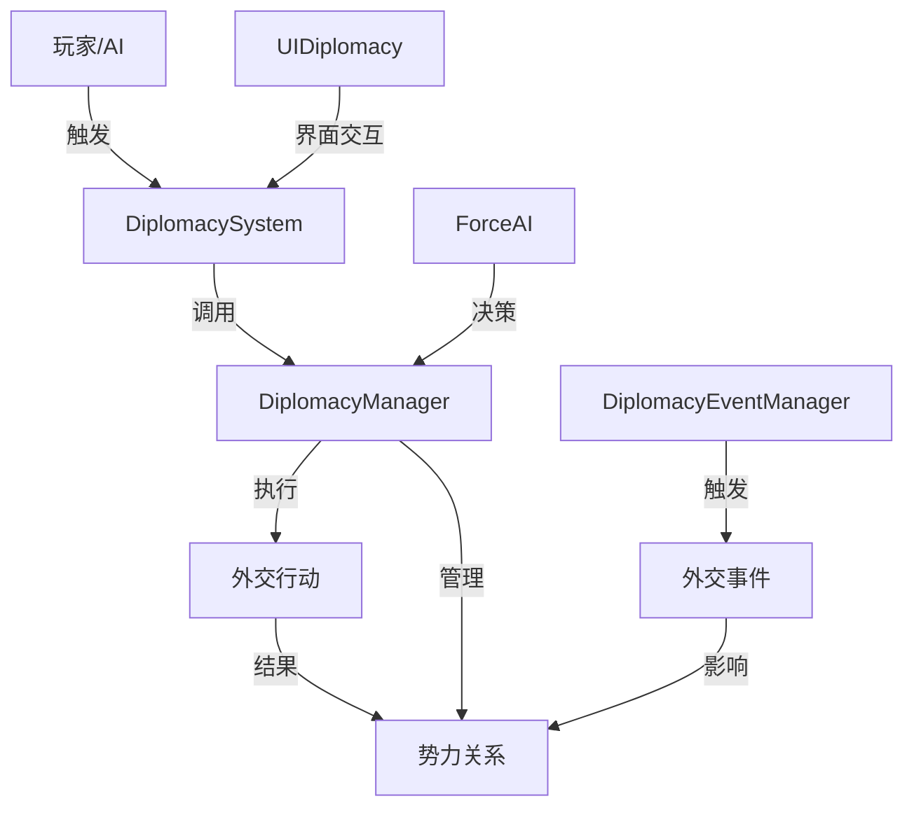

# 外交系统设计文档

## 1. 系统概述

外交系统是游戏中势力间互动的核心机制，允许玩家和AI势力通过各种外交手段来维护关系、结成同盟、解决冲突等。本设计文档旨在完善现有的外交系统，增加新功能并优化用户体验。

## 2. 现有系统分析

### 2.1 核心组件

| 组件 | 职责 | 文件路径 |
|------|------|----------|
| DiplomacyManager | 管理势力间关系和执行外交行动 | `System/Diplomacy/DiplomacyManager.cs` |
| DiplomacyEventManager | 管理和触发外交事件 | `System/Diplomacy/DiplomacyEventManager.cs` |
| DiplomacySystem | 处理外交系统的启动和执行 | `System/Diplomacy/DiplomacySystem.cs` |
| UIDiplomacy | 外交界面 | `Render/UI/UIDiplomacy.cs` |
| ForceRelation | 势力关系数据结构 | `Object/ForceRelation.cs` |
| Alliance | 联盟系统 | `Object/Alliance.cs` |
| ForceAI.AIDiplomacy | AI外交决策 | `Object/Force/ForceAI.cs` |

### 2.2 现有功能

- **势力关系管理**：设置、增加、减少关系值
- **外交行动**：
  - 结盟 (Alliance)
  - 停战 (Truce)
  - 宣战 (DeclareWar)
  - 送礼 (SendGift)
  - 请求技术 (RequestTechnique)
  - 请求兵力 (RequestTroops)
  - 通商 (Trade)
  - 和亲 (Marriage)
  - 请求结盟 (AllianceRequest)
  - 请求停战 (TruceRequest)
- **外交事件**：
  - 使者来访
  - 边境冲突
  - 贸易提议
  - 结盟邀请
  - 停战请求
  - 技术交流
  - 领土争端
  - 共同敌人
- **AI外交决策**：根据关系值和资源情况决定执行哪些外交行动

### 2.3 现有系统不足

1. **功能完整性**：部分外交行动（如请求兵力、通商）的具体实现不完善
2. **用户体验**：外交界面功能有限，操作流程不够直观
3. **AI决策**：AI外交决策逻辑较为简单，缺乏深度和策略性
4. **事件系统**：外交事件种类较少，触发机制不够灵活
5. **扩展性**：系统架构不够模块化，难以添加新功能

## 3. 系统设计

### 3.1 设计目标

1. **功能完善**：实现所有外交行动的完整逻辑
2. **用户友好**：提供直观、易用的外交界面
3. **AI智能**：增强AI外交决策能力，使其更加策略化
4. **事件丰富**：增加更多外交事件，丰富游戏体验
5. **架构清晰**：采用模块化设计，提高系统可扩展性

### 3.2 系统架构

### 3.3 核心功能设计

#### 3.3.1 势力关系系统

- **关系值范围**：-2000（敌对）到 2000（友好）
- **关系状态**：
  - 敌对 (< -1000)
  - 紧张 (-1000 到 -500)
  - 中立 (-500 到 500)
  - 友好 (500 到 1000)
  - 亲密 (> 1000)
- **关系影响因素**：
  - 外交行动
  - 外交事件
  - 战争状态
  - 共同敌人
  - 领土争端

#### 3.3.2 外交行动系统

| 行动类型 | 关系要求 | 资源要求 | 效果 |
|---------|---------|---------|------|
| 结盟 | ≥ 1000 | 3000 金 | 建立同盟关系，共享情报和军事支持 |
| 停战 | ≥ -500 | 2000 金 | 暂时停止敌对状态，持续一定回合 |
| 宣战 | 无 | 无 | 进入战争状态，关系大幅下降 |
| 送礼 | 无 | 500-2000 金 | 增加关系值 |
| 请求技术 | ≥ 500 | 1000 金 | 有概率获得对方的一项技术 |
| 请求兵力 | ≥ 800 | 2000 金 | 有概率获得对方的军事支持 |
| 通商 | ≥ 0 | 1000 金 | 双方获得经济收益 |
| 和亲 | ≥ 800 | 5000 金 | 大幅增加关系值，可能产生特殊效果 |
| 请求结盟 | ≥ 800 | 2000 金 | 有概率与对方结盟 |
| 请求停战 | ≥ -800 | 1500 金 | 有概率与对方停战 |

#### 3.3.3 外交事件系统

- **事件触发条件**：
  - 随机触发（基于概率）
  - 特定条件触发（如关系达到某一阈值）
  - 玩家行为触发（如宣战、结盟）
- **事件类型**：
  - 友好事件（增加关系）
  - 敌对事件（减少关系）
  - 中性事件（可能有正负影响）
- **事件效果**：
  - 改变势力关系
  - 触发特殊任务
  - 影响经济或军事

#### 3.3.4 AI外交决策系统

- **决策因素**：
  - 当前关系值
  - 资源状况
  - 军事力量对比
  - 地缘政治因素
  - 共同敌人
  - 历史互动
- **决策策略**：
  - 防御型：优先维持和平，避免冲突
  - 扩张型：积极寻求同盟，对抗敌人
  - 中立型：保持平衡，避免站队

#### 3.3.5 外交界面系统

- **界面组成**：
  - 势力选择列表
  - 关系状态显示
  - 外交行动按钮
  - 使者选择
  - 外交历史记录
- **交互流程**：
  1. 选择目标势力
  2. 查看当前关系和历史
  3. 选择外交行动
  4. 选择使者（如果需要）
  5. 确认执行

## 4. 实现方案

### 4.1 代码结构调整

1. **DiplomacyManager**：
   - 完善所有外交行动的具体实现
   - 增加关系状态判断逻辑
   - 优化关系计算算法

2. **DiplomacyEventManager**：
   - 增加更多外交事件
   - 实现事件触发条件的灵活配置
   - 添加事件效果的可扩展性

3. **DiplomacySystem**：
   - 优化系统启动和执行流程
   - 增加错误处理和状态管理
   - 提供更丰富的外交数据接口

4. **UIDiplomacy**：
   - 重新设计界面布局
   - 增加外交历史记录
   - 优化操作流程和反馈机制

5. **ForceAI**：
   - 增强AIDiplomacy逻辑
   - 实现不同类型AI的外交策略
   - 考虑更多决策因素

### 4.2 新增功能实现

1. **通商系统**：
   - 实现通商协议的创建和管理
   - 计算通商带来的经济收益
   - 处理通商中断的情况

2. **军事支持系统**：
   - 实现请求兵力的具体逻辑
   - 计算支持兵力的数量和质量
   - 处理支持期限和召回机制

3. **外交历史系统**：
   - 记录势力间的外交互动历史
   - 影响后续外交决策
   - 提供历史查询功能

4. **使者系统**：
   - 使者能力影响外交行动成功率
   - 使者可能被扣留或暗杀
   - 特殊使者有额外效果

5. **联盟管理系统**：
   - 联盟等级和福利
   - 联盟任务和目标
   - 联盟解散和背叛机制

### 4.3 性能优化

1. **关系计算优化**：
   - 使用缓存减少重复计算
   - 批量处理关系更新

2. **AI决策优化**：
   - 预处理决策因素
   - 使用决策树减少计算复杂度

3. **事件系统优化**：
   - 事件触发条件的预计算
   - 事件效果的批处理

4. **界面优化**：
   - 延迟加载非关键数据
   - 优化UI渲染性能

## 5. 测试计划

### 5.1 功能测试

1. **外交行动测试**：
   - 测试所有外交行动的执行逻辑
   - 验证资源消耗和效果
   - 测试边界条件和错误处理

2. **关系系统测试**：
   - 测试关系值的计算和更新
   - 验证关系状态的正确切换
   - 测试各种因素对关系的影响

3. **事件系统测试**：
   - 测试事件的触发条件
   - 验证事件效果的正确执行
   - 测试事件的多样性和随机性

4. **AI外交测试**：
   - 测试不同类型AI的外交策略
   - 验证AI决策的合理性
   - 测试AI对不同情况的反应

5. **界面测试**：
   - 测试界面的布局和交互
   - 验证数据显示的准确性
   - 测试操作流程的流畅性

### 5.2 性能测试

1. **响应时间测试**：
   - 测试外交界面的加载和响应时间
   - 验证大量势力时的性能表现

2. **计算性能测试**：
   - 测试AI外交决策的计算时间
   - 验证关系计算的性能

3. **内存使用测试**：
   - 测试外交系统的内存占用
   - 验证内存泄漏情况

## 6. 扩展计划

### 6.1 未来功能扩展

1. **联盟战争系统**：
   - 支持联盟间的集体战争
   - 实现联盟贡献和奖励机制

2. **外交使命系统**：
   - 增加特殊外交任务
   - 提供独特的奖励和挑战

3. **国际组织系统**：
   - 实现类似联合国的国际组织
   - 提供全球事件和决议机制

4. **秘密外交系统**：
   - 支持秘密结盟和背叛
   - 增加外交间谍和情报收集

5. **文化交流系统**：
   - 实现文化传播和影响
   - 增加文化对关系的影响

### 6.2 技术扩展

1. **数据驱动设计**：
   - 将外交事件和行动配置为数据
   - 支持通过配置文件扩展系统

2. **模块化架构**：
   - 进一步分离核心逻辑和表现层
   - 支持插件式扩展

3. **网络同步**：
   - 实现多人游戏中的外交同步
   - 支持实时外交谈判

## 7. 结论

通过本设计文档的实现，外交系统将成为游戏中一个深度、有趣且策略性的核心机制。玩家将能够通过各种外交手段来实现自己的游戏目标，而AI势力也将展现出更加智能和多样化的外交行为。同时，系统的模块化设计也为未来的扩展和改进提供了良好的基础。